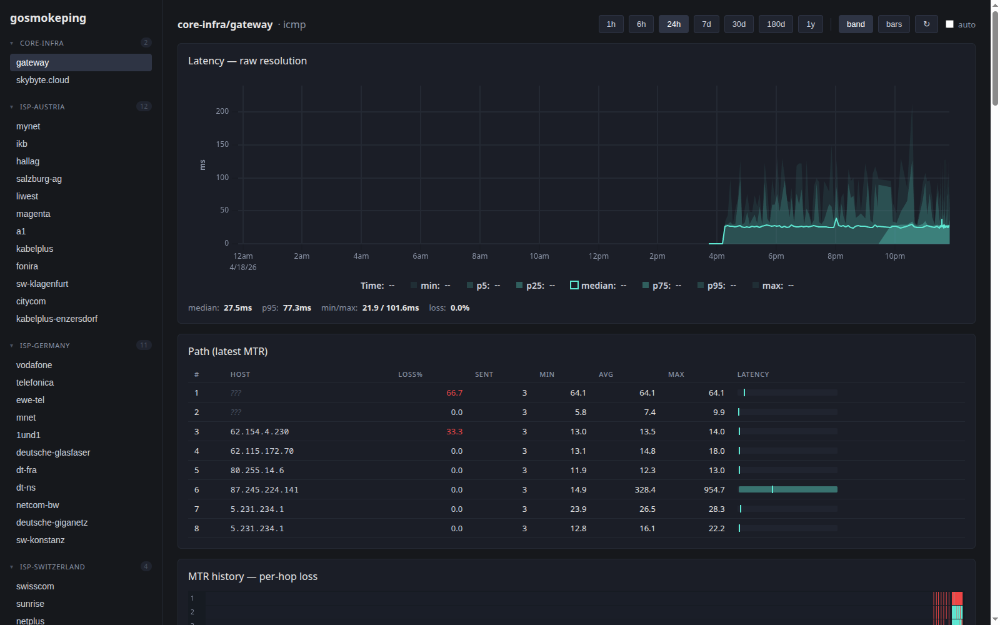
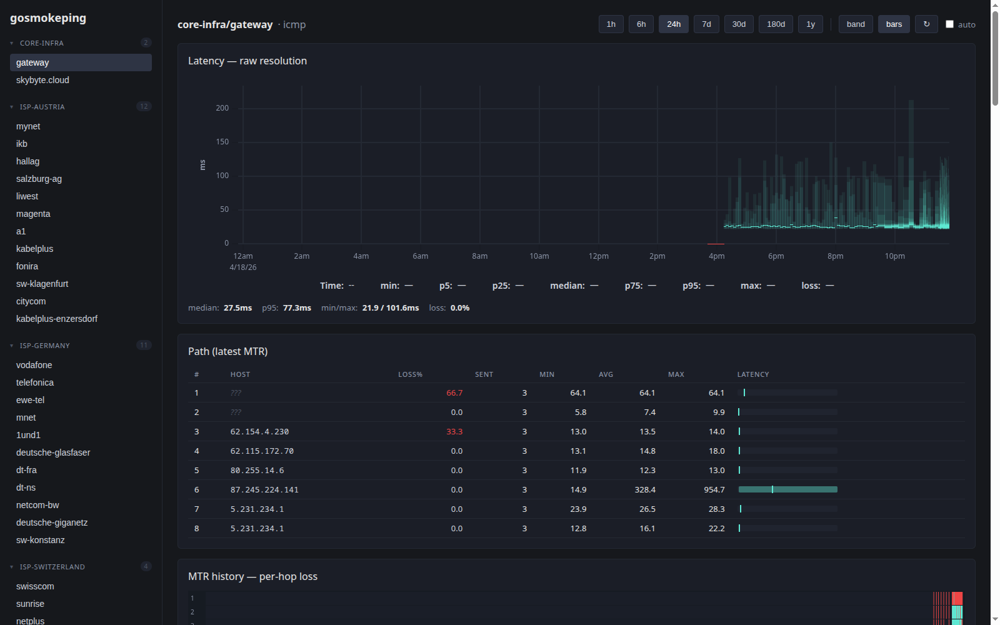

# gosmokeping

A modern, single-binary replacement for [SmokePing](https://oss.oetiker.ch/smokeping/).
Keeps the classic "smoke band" latency visualization (min–max + p5–p95 + median)
and adds a JSON API, a React + uPlot UI, InfluxDB v2 storage with tiered
rollups, MTR path discovery, and Grafana integration.

> **Heads up — this project is AI-coded.**
> Every line of Go, TypeScript, CSS, and Flux in this repo was written by
> Claude under human direction. It's been shaped by iterative review, used
> in anger, and the tests are real — but there is no seasoned human
> maintainer standing behind each commit. Treat it like any other
> unpaid-volunteer hobby tool: read before deploying, pin versions, don't
> put it on the critical path without your own review.

## Screenshots

**24h latency, smoke band:**



**24h latency, per-cycle bars (classic SmokePing style):**



Below each chart the UI shows the latest MTR path (hops, per-hop loss, min/avg/max)
and a per-hop loss heatmap over the same window.

## Features

- **Probes:** ICMP (unprivileged ping sockets with raw fallback), TCP connect,
  HTTP(S) TTFB, DNS lookup, MTR-style path discovery.
- **Storage:** InfluxDB v2 with tiered rollups (raw samples 7d, 1h 180d,
  1d 2y) created automatically on startup via Flux tasks.
- **UI:** React + Vite + uPlot, embedded in the binary. Smoke band and
  classic-bars chart modes, MTR table, per-hop loss heatmap.
- **Alerting:** threshold conditions with sustained-cycles debounce.
  Actions: `log`, shell `exec`, generic `webhook`, and a first-class
  `discord` embed (includes MTR path in the embed when the probe is
  icmp/mtr).
- **Grafana:** drop-in dashboard with smoke bands and loss overlays.
- **Hot reload:** `SIGHUP`.

## Build

```bash
make ui     # vite build → internal/ui/dist/
make build  # go build → ./gosmokeping
```

Or build a container:

```bash
docker build -t gosmokeping .
```

## Run

1. Copy and edit the example config:

   ```bash
   cp config.example.json config.json
   $EDITOR config.json
   ```

2. ICMP/MTR need raw sockets. Either run as root, enable
   `net.ipv4.ping_group_range` for your gid (ICMP only — MTR still needs
   raw), or:

   ```bash
   make setcap
   ```

3. Start:

   ```bash
   ./gosmokeping -config config.json
   ```

4. Open <http://localhost:8080>.

## Config

See [`config.example.json`](config.example.json). Environment variables of
the form `${NAME}` are expanded at load time, so tokens live in env vars.
`SIGHUP` re-reads the file.

Alert actions:

```json
"actions": {
  "slack":   { "type": "webhook", "url": "https://hooks.slack.com/..." },
  "discord": { "type": "discord", "url": "${DISCORD_WEBHOOK_URL}" },
  "page":    { "type": "exec",    "command": "/usr/local/bin/pager" }
}
```

For icmp/mtr targets the Discord embed appends an MTR-style path block so
you can see where a cycle broke without opening the UI.

## HTTP API

| Method | Path                                                | Purpose |
|--------|-----------------------------------------------------|---------|
| GET    | `/api/v1/health`                                    | Health + uptime |
| GET    | `/api/v1/targets`                                   | List all targets |
| GET    | `/api/v1/targets/{group}/{name}/cycles?from&to&resolution` | Aggregates |
| GET    | `/api/v1/targets/{group}/{name}/rtts?from&to`       | Raw per-ping samples |
| GET    | `/api/v1/targets/{group}/{name}/status`             | Last 50 cycles |
| GET    | `/api/v1/targets/{group}/{name}/hops`               | Latest MTR path |
| GET    | `/api/v1/targets/{group}/{name}/hops/timeline?from&to` | Per-hop history |

`from` / `to` accept RFC3339, unix seconds, or durations like `-24h`.
`resolution` is `auto` (default), `raw`, `1h`, or `1d`.

## Deployment

- **systemd:** see [`deploy/gosmokeping.service`](deploy/gosmokeping.service).
- **Docker:** the image grants `CAP_NET_RAW` to the binary via `setcap`.
- **Reverse proxy:** terminate TLS and authenticate at the proxy
  (Nginx/Caddy). The binary has no built-in auth.

## Grafana

Import [`grafana/dashboard.json`](grafana/dashboard.json) and point it at
your InfluxDB v2 Flux datasource. See [`grafana/README.md`](grafana/README.md).

## Development

```bash
make dev        # go run with debug logging
make ui-dev     # vite dev server on :5173 (proxies /api to :8080)
make test       # unit tests
make test-integration   # requires INFLUX_URL/INFLUX_TOKEN/INFLUX_ORG
make lint       # go vet
```

See [`CLAUDE.md`](CLAUDE.md) for the architecture notes an LLM (or a
human reviewer) needs to make sense of the pipeline — scheduler-as-hub,
config hot-reload contract, storage tiering, ICMP socket quirks, MTR
trace behavior, rollup task versioning, and the UI time-axis contract.

## Layout

```
cmd/gosmokeping/    # entrypoint
internal/
  alert/            # threshold evaluator + dispatchers (log/webhook/discord/exec)
  api/              # chi router + handlers
  config/           # JSON loader + hot-reload store
  probe/            # ICMP/TCP/HTTP/DNS/MTR implementations + shared trace
  scheduler/        # per-target probe scheduler + sink fanout
  stats/            # RTT aggregation (min/max/mean/median/p5–p95/stddev)
  storage/          # InfluxDB client (writer, reader, bootstrap)
  ui/               # embed.FS wrapper for the built SPA
ui/                 # React + Vite + uPlot SPA source
grafana/            # provisioned dashboard
deploy/             # systemd unit
docs/screenshots/   # README screenshots
```

## License

MIT. Fork, break, improve.
