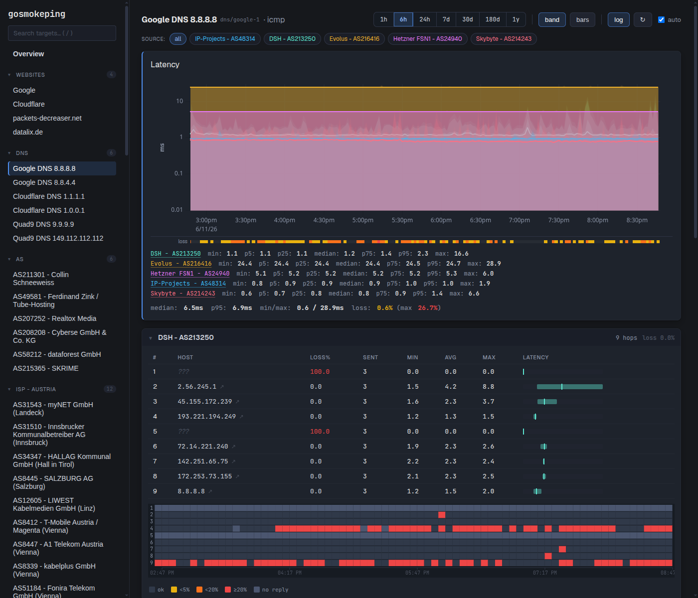
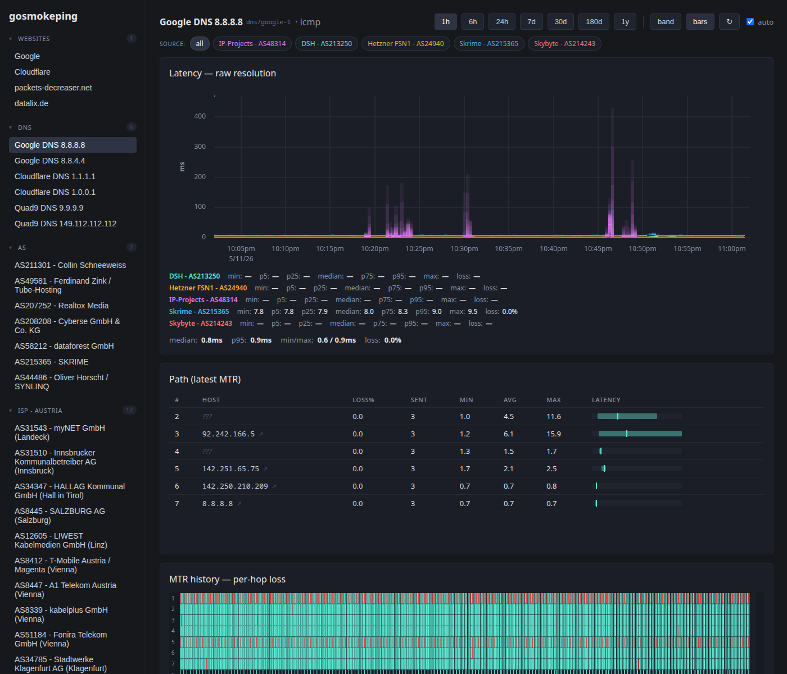
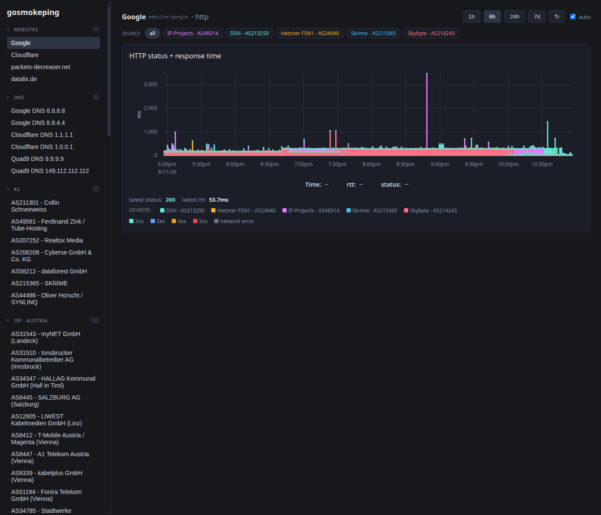

# gosmokeping

A modern, single-binary replacement for [SmokePing](https://oss.oetiker.ch/smokeping/).
Keeps the classic "smoke band" latency visualisation (min–max + p5–p95 + median),
adds a JSON API, a React + uPlot UI, InfluxDB v2/v3 storage, MTR path discovery,
HTTP/DNS probes, and optional master/slave distributed probing from multiple
vantage points.

> **Heads up — this project is AI-coded.**
> Every line of Go, TypeScript, CSS, and Flux in this repo was written by
> Claude under human direction. It's been shaped by iterative review, used
> in anger, and the tests are real — but there is no seasoned human
> maintainer standing behind each commit. Treat it like any other
> unpaid-volunteer hobby tool: read before deploying, pin versions, don't
> put it on the critical path without your own review.

## Screenshots

**ICMP — smoke band mode, 5 probe sources, 6 h window:**



**ICMP — classic SmokePing per-cycle bars mode:**



Both views include a per-source legend with live percentile readouts, a stats
bar (median / p95 / min–max / loss%), the latest MTR hop table (TTL, IP,
loss%, min/avg/max, latency bar), and a per-hop loss heatmap over the same
window. Clicking any column in the heatmap or any point on the chart pins the
hop table to that cycle.

**HTTP probe — per-request RTT bars colour-coded by status class:**



Source chips above each chart let you drill into a single vantage point;
the "all" view overlays every source with its own palette colour.

## Features

- **Probes:** ICMP (unprivileged UDP ping sockets, raw fallback), TCP connect,
  HTTP(S) TTFB, DNS lookup, MTR-style path discovery.
- **Storage:** InfluxDB v2 (tiered rollups via Flux tasks: raw 7 d, 5 m, 1 h,
  1 d) or InfluxDB v3 (single database, query-time `date_bin` aggregation).
  Buckets and tasks are created automatically on startup.
- **UI:** React + Vite + uPlot, embedded in the binary. Smoke band and
  classic-bars chart modes, MTR hop table, per-hop loss heatmap, drag-to-zoom,
  shareable URLs, auto-refresh.
- **Multi-source:** run extra instances with `--slave` to probe from multiple
  vantage points; the master aggregates, persists, and presents all sources
  in a single UI. Per-target slave assignment supported.
- **Alerting:** threshold conditions with sustained-cycles debounce.
  Actions: `log`, shell `exec`, generic `webhook`, and a first-class
  `discord` embed (includes MTR path for icmp/mtr targets).
- **Hot reload:** `SIGHUP` re-reads the config without dropping cycles.

## Quick start

Prerequisites: Go 1.26+, Node 20+, a running InfluxDB v2 instance.

### 1. Start InfluxDB and grab credentials

```bash
docker run -d --name influxdb -p 8086:8086 \
  -e DOCKER_INFLUXDB_INIT_MODE=setup \
  -e DOCKER_INFLUXDB_INIT_USERNAME=admin \
  -e DOCKER_INFLUXDB_INIT_PASSWORD=changeme123 \
  -e DOCKER_INFLUXDB_INIT_ORG=smokeping \
  -e DOCKER_INFLUXDB_INIT_BUCKET=smokeping_raw \
  -e DOCKER_INFLUXDB_INIT_ADMIN_TOKEN=supersecret-replace-me \
  influxdb:2
```

gosmokeping creates the `smokeping_5m`, `smokeping_1h`, and `smokeping_1d`
rollup buckets and their Flux tasks automatically on first start.

### 2. Configure

```bash
cp config.example.json config.json
cp .env.example .env
```

Edit `.env`:

```bash
INFLUX_URL=http://localhost:8086
INFLUX_ORG=smokeping
INFLUX_TOKEN=supersecret-replace-me
```

Edit `config.json` to list the hosts you want to probe. The example ships
with `1.1.1.1` and `8.8.8.8` so the first run is immediately useful.

### 3. Build

```bash
make ui     # vite build → internal/ui/dist/
make build  # go build → ./gosmokeping
```

Or with Docker:

```bash
docker build -t gosmokeping .
```

### 4. Grant raw-socket capability

ICMP and MTR need raw sockets. Either run as root, or:

```bash
make setcap   # sudo setcap cap_net_raw+ep ./gosmokeping
```

The Docker image and the bundled systemd unit handle this automatically.

### 5. Run

```bash
./gosmokeping -config config.json
```

Open <http://localhost:8080>. Cycles start landing within one probe
interval (default 30 s).

## Config

See [`config.example.json`](config.example.json). Environment variables
(`${NAME}`) are expanded at load time, so tokens stay in env vars. `SIGHUP`
re-reads the file live.

`.env` is auto-loaded from the directory holding `--config` first, then
from the current working directory (important under systemd where cwd is `/`).
Real shell env always wins over `.env`; a missing `.env` is silently ignored.

### Storage backend

`storage.backend` selects the persistence layer:

| Value | Description |
|-------|-------------|
| `"influxv2"` | Default. Four buckets, tiered Flux rollups, Flux queries. |
| `"influxv3"` | Single database, SQL/Arrow Flight queries, query-time `date_bin`. Good for high write throughput from many slaves. |

### Trimming raw bucket size

`probe_hop` (MTR + opportunistic ICMP traces) dominates raw-bucket storage
on busy installs. Two knobs:

1. **Reduce raw retention.** `influxv2.Bootstrap` creates `smokeping_raw`
   with 7-day retention by default. Cut it to 48h with the influx CLI:

   ```bash
   docker exec smokeping-influxdb-1 influx bucket list
   docker exec smokeping-influxdb-1 influx bucket update \
     --id <smokeping_raw-id> --retention 48h
   ```

   Cycle min/avg/max/loss survive in the 5m/1h/1d rollups; only per-ping
   (`probe_rtt`) and per-hop (`probe_hop`) detail is shortened.

2. **Suppress baseline hop writes** via `storage.hop_policy.mode`:

   | Mode | Behaviour |
   |------|-----------|
   | `always` (default) | Every cycle that has hops writes them. Legacy behaviour, no upgrade surprise. |
   | `on_loss` | Hops written only when the trace's last hop reports `Lost > 0`. |
   | `sampled` | One write per `sample_every` window per `(target, source)`: a loss cycle fills the slot, otherwise a baseline snapshot does. Loss wins, baseline fills the gap. Requires `sample_every` (e.g. `"30m"`). |

   ```json
   "storage": {
     "backend": "influxv2",
     "influxv2": { ... },
     "hop_policy": { "mode": "sampled", "sample_every": "30m" }
   }
   ```

   Mode changes require a restart (the writer captures the policy at
   construction; no hot-reload). Combined with reduced retention,
   hop-heavy installs typically see `smokeping_raw` shrink by an order
   of magnitude after the next InfluxDB compaction.

### Alert conditions

Each alert's `condition` is a single predicate `<field> <op> <value>`. No
AND/OR — to combine criteria, attach multiple alerts to the target.

| Field | Unit | Notes |
|-------|------|-------|
| `loss_pct` | percent | Target-level loss. MTR mirrors the final hop (target) or reports full loss when unreachable; intermediate hop drops are ignored. |
| `rtt_min`, `rtt_max`, `rtt_mean`, `rtt_median`, `rtt_stddev` | ms | Per-cycle summary across the cycle's RTT samples. |
| `rtt_p5`, `rtt_p95` | ms | Other percentiles (`p10`..`p90`) are computed and stored, but not currently accepted as alert fields. |

Operators: `>` `>=` `<` `<=` `==` `!=`. Avoid `==`/`!=` on `rtt_*` —
those are float milliseconds. `rtt_*` values accept Go duration syntax
(`50ms`, `1.5s`); a bare number is interpreted as milliseconds.

```json
"alerts": {
  "high-loss":    { "condition": "loss_pct > 5",      "sustained": 3, "actions": ["log"] },
  "high-latency": { "condition": "rtt_median > 50ms", "sustained": 5, "actions": ["log"] }
}
```

**Sustained / debounce.** `sustained: N` requires `N` consecutive bad
cycles before the alert transitions to `firing` (with a `pending` event
on the first bad cycle if `N > 1`). `0` and `1` are equivalent — first
bad cycle fires immediately. A single good cycle resets the counter and
transitions back to `ok`; there is no hysteresis, so a metric oscillating
across the threshold will produce a transition per cycle.

**Full-loss cycles.** When every probe in a cycle fails, all `rtt_*`
fields read as `0`, so a condition like `rtt_median > 50` will *not*
fire on an outage — pair it with a `loss_pct` alert if you want both
"slow" and "down" coverage.

**State lifetime.** Alert state lives in memory only. Restarts return
every alert to `ok`; if a target is still bad, the next cycle re-walks
`ok → pending/firing` and re-emits the event. In cluster mode state is
keyed by `(target, alert, source)`, so a slave firing does not affect
the master's counter for the same target.

### Alert actions

| Type | Shape |
|------|-------|
| `log` | Structured log line. |
| `webhook` | Generic JSON POST; `template` overrides the default body. |
| `discord` | Rich embed with RTT, loss, sustained-cycle count, and MTR path. |
| `exec` | Shell command with alert payload in env vars. |

```json
"actions": {
  "slack":   { "type": "webhook", "url": "https://hooks.slack.com/..." },
  "discord": { "type": "discord", "url": "${DISCORD_WEBHOOK_URL}" },
  "page":    { "type": "exec",    "command": "/usr/local/bin/pager" }
}
```

## HTTP API

| Method | Path | Purpose |
|--------|------|---------|
| GET | `/api/v1/health` | Health + uptime |
| GET | `/api/v1/targets` | List all targets |
| GET | `/api/v1/targets/{group}/{name}/cycles?from&to&resolution` | Aggregated latency |
| GET | `/api/v1/targets/{group}/{name}/rtts?from&to` | Raw per-ping samples |
| GET | `/api/v1/targets/{group}/{name}/http?from&to` | Raw HTTP samples |
| GET | `/api/v1/targets/{group}/{name}/hops` | Latest MTR path |
| GET | `/api/v1/targets/{group}/{name}/hops/timeline?from&to` | Per-hop loss history |

`from` / `to` accept RFC3339, unix seconds, or durations like `-24h`.
`resolution` is `auto` (default), `raw`, `5m`, `1h`, or `1d`. All endpoints
accept `source=<name>` to filter by probe origin in master/slave deployments.

## Deployment

**systemd** — run `sudo ./deploy/install.sh` after `make build`. Creates a
`gosmokeping` system user, installs the binary to `/opt/smokeping/gosmokeping`,
stages `/opt/smokeping/` for config + `.env`, and installs the unit file. The
unit grants `CAP_NET_RAW` via systemd — no `setcap` needed. Re-run to update;
it's idempotent.

**Docker** — the image runs as an unprivileged user and grants `CAP_NET_RAW`
to the binary via `setcap`:

```bash
docker run -d --name gosmokeping -p 8080:8080 \
  -v $(pwd)/config.json:/opt/smokeping/config.json:ro \
  -v $(pwd)/.env:/opt/smokeping/.env:ro \
  gosmokeping
```

**Reverse proxy** — terminate TLS and authenticate at the proxy (Nginx/Caddy).
The binary has no built-in auth.

## Master / slave

Run extra `--slave` instances to probe every target from multiple vantage
points simultaneously. The master aggregates all cycles, persists to InfluxDB,
and shows each source as a separately filterable overlay in the UI.

**Master** `config.json`:

```json
"cluster": {
  "token": "${CLUSTER_TOKEN}",
  "source": "master"
}
```

By default every target is probed by the master and all registered slaves.
To restrict a target to specific slaves only (master skips it locally):

```json
{ "name": "Berlin POP", "host": "10.0.1.1", "slaves": ["berlin-1"] }
```

**Slave** — copy [`config.slave.example.json`](config.slave.example.json),
set `master_url`, `token`, and a unique `name`, then:

```bash
./gosmokeping --slave -config config.slave.json
```

The slave registers with the master, pulls the target list, probes locally,
and pushes cycle batches back every few seconds. A 600-cycle ring buffer
absorbs short master outages. Slaves never touch InfluxDB or the UI.

## Development

```bash
make dev               # go run with debug logging
make ui-dev            # vite dev server on :5173 (proxies /api to :8080)
make test              # unit tests
make test-integration  # requires INFLUX_URL / INFLUX_TOKEN / INFLUX_ORG
make lint              # go vet
```

See [`CLAUDE.md`](CLAUDE.md) for architecture notes covering the
scheduler-as-hub pipeline, config hot-reload contract, storage tiering,
ICMP socket quirks, MTR trace semantics, rollup task versioning, and the
UI time-axis contract.

## Layout

```
cmd/gosmokeping/    # entrypoint (main, run_node, run_slave, logger)
internal/
  alert/            # threshold evaluator + dispatchers (log/webhook/discord/exec)
  api/              # chi router + handlers
  cluster/          # master+slave HTTP protocol and runners
  config/           # JSON loader + hot-reload store
  probe/            # ICMP/TCP/HTTP/DNS/MTR + shared TTL-walk trace
  scheduler/        # per-target probe scheduler + sink fanout
  stats/            # RTT aggregation (min/max/mean/median/p5–p95/stddev)
  storage/          # InfluxDB v2 + v3 writers, readers, bootstrap
  ui/               # embed.FS wrapper for the built SPA
ui/                 # React + Vite + uPlot SPA source
deploy/             # systemd unit + install script
docs/screenshots/   # README screenshots
```

## Migrating from SmokePing

`smokeping2gosmokeping` reads a SmokePing `Config::Grammar` config and emits
an equivalent gosmokeping JSON config. It follows `@include` directives and
translates the common probe/alert shapes.

```bash
smokeping2gosmokeping -in /etc/smokeping/config -out config.json
# writes config.json and config.json.notes.txt
```

Storage credentials are emitted as `${INFLUX_URL}` / `${INFLUX_TOKEN}` /
`${INFLUX_ORG}` placeholders. Add `-strict` to exit 2 on any untranslatable
construct, useful in CI-driven config generation.

## License

MIT. Fork, break, improve.
